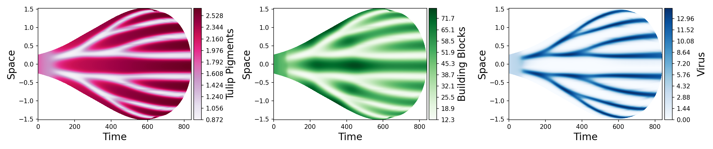
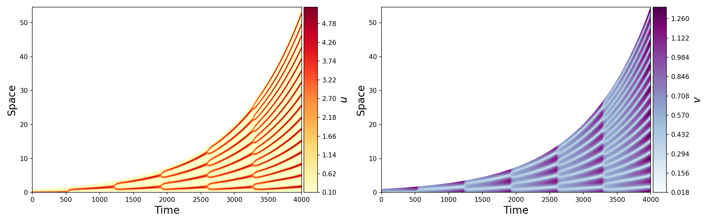

# reaction-diffusion-growing-domain
 Solves 1D reaction diffusion equations on a growing domain

## How to Use

1. Enter your reaction functions inside `resources/reaction_func.py` following the formats provided
2. Include your initial conditions with your reaction functions
3. Enter or edit your growth functions inside `resources/grow_func.py`. This function should be normalized such that it starts at 1. Choose `growno()` if you do not want any domain growth.
4. Also, add the derivative of your growth function.
4. Go to `main.py`, set desired values, and run!
```
def main():

    width = 0.5
    D, R, init = reaction_func.tbv_model_dim()
    dt = 0.01
    dx = 0.0003 
    T = 840
    
    r, rt, radius = grow_func.growforward(width=width, time_mult=T/ORIGINAL_PETAL_LENGTH)

    steps = 50
    n_steps = round(T / (steps * dt))

    ReactDiffusion(
        D, R, r, rt, 
        ic=init, bc="neumann",
        width=width, dx=dx, dt=dt,
        steps=steps, labels=["Tulip Pigments", "Building Blocks", "Virus"], cmaps=["PuRd", "Greens", "Blues"]
    ).plot_tri("reaction-diffusion-growing-domain/figures/test_tbv_petal.png", 
               n_steps=n_steps, symmetry=True, radius=radius, flipx=False, flipy=False)

main()
```
### Parameters
- `width` is the initial domain width
- `D` is an array of diffusion coefficients
- `R` is an array of reaction functions for the PDE
- `init` is a function containing the initial conditions
- `dt` and `dx` are the time and space increments respectively
- `T` is the final time
- `r` and `rt` are your normalized growth function and its derivative respectively.
- If you want to curve your graph to a petal-like shape or otherwise, `radius` is a function that defines the radius of curvature as a function of time.
### Utility parameters
- `steps` is the number of calculation steps between recording data for plotting it (i.e. the greater the steps, the lower the resolution).
- `n_steps` is the number of times the simulation runs for the number of `steps` (i.e. the tot.al number of calculations will be `n_steps * steps`)
- Also, the boundary conditions `bc` can be either `neumann` for Neumann conditions or `dirichlet` for Dirichlet conditions.
- Change `labels` for the labels for each variable.
- Change `cmaps` for different colour maps.
- If True, `flipx` makes the x-axis run from the maximum (`T`) to minimum (zero) as one goes from left to right.
- If True, `flipy` makes the x-axis denote space and the y-axis denote time.
- If True, `symmetry` centers the plot around the line where space equals zero. It needs to be True before any curvature can be applied!

The above code generates the following image



Currently, `main.py` looks like this:

```
def main():

    width = 1
    D, R, init = reaction_func.schnak()
    dt = 0.1
    dx = 0.005 
    T = 4000
    
    r, rt = grow_func.growexp()

    steps = 50
    n_steps = round(T / (steps * dt))

    ReactDiffusion(
        D, R, r, rt, 
        ic=init, bc="neumann",
        width=width, dx=dx, dt=dt,
        steps=steps, labels=[r"$u$", r"$v$"], cmaps=["YlOrRd", "BuPu"]# ["PuRd", "Greens", "Blues"]
    ).plot_tri("reaction-diffusion-growing-domain/figures/test.png", 
               n_steps=n_steps, symmetry=False, radius=None, flipx=False, flipy=False)

main()
```

Which calculates the Schnakenberg model given below

$$ \begin{align}  \frac{\partial u}{\partial t} &= \frac{\partial^2 u}{\partial x^2} + \alpha - u + u^2 v \\frac{\partial v}{\partial t} &= \frac{\partial^2 v}{\partial x^2} + \beta - u^2 v \\\frac{\partial u}{\partial x} \biggr|_{x=0,L} &= 0 \\\frac{\partial v}{\partial x} \biggr|_{x=0,L} &= 0\\L(t) = e^{\rho t}\end{align} $$

Where $\rho = 0.001$

